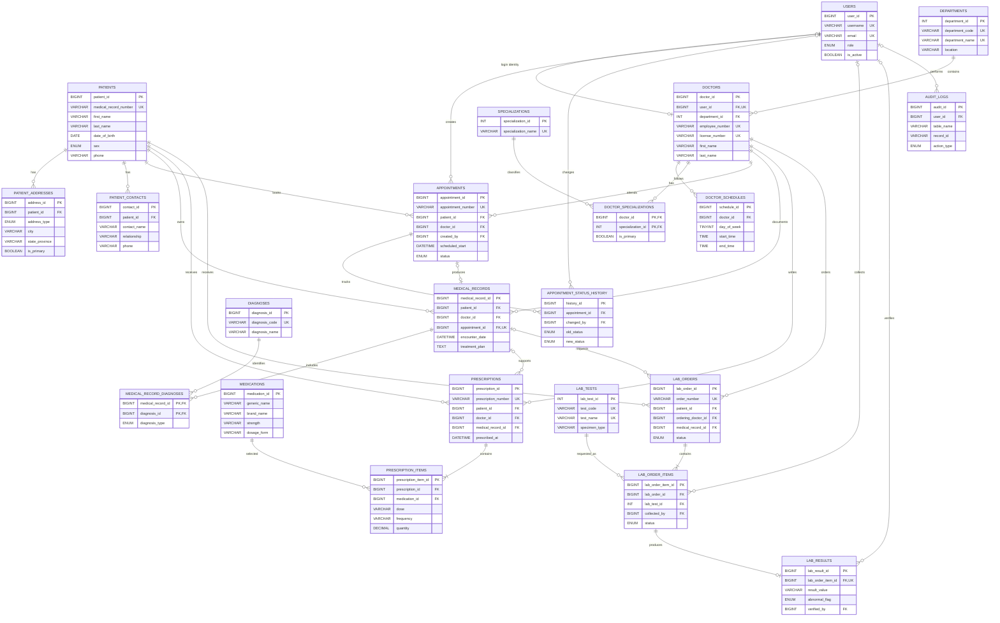

# Hospital Database ER Diagram

This Entity-Relationship model supports patients, doctors, appointments, encounters, diagnoses, prescriptions, and laboratory records. Paste the Mermaid block into a Mermaid-enabled Markdown viewer, GitHub, or Mermaid Live Editor to render the diagram.

## Relationship Summary

- One patient can have many addresses, contacts, appointments, medical records, prescriptions, and laboratory orders.
- One doctor belongs to one department and may have many specializations through the junction table.
- An appointment may produce at most one medical record.
- A medical record can contain many diagnoses using a many-to-many junction table.
- A prescription contains one or more prescription items, each linked to a medication master record.
- A laboratory order contains one or more test items, with up to one verified result per item.
