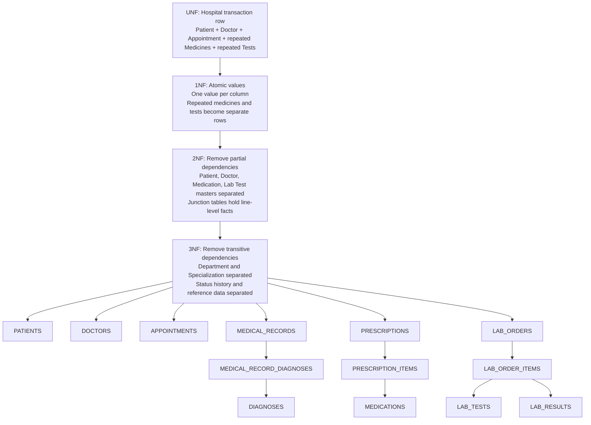

# Hospital Database Normalization Diagram

The schema is designed to Third Normal Form (3NF). The progression below shows how a single denormalized hospital transaction is separated into stable subject tables and relationship tables.



## Normalization Decisions

### Unnormalized Form (UNF)
A hypothetical combined record might store patient details, doctor details, appointment data, multiple prescribed drugs, and multiple laboratory tests in one row. This creates repeating groups and makes inserts, updates, and deletions unsafe.

### First Normal Form (1NF)
- Every table has a primary key.
- Columns contain atomic values rather than lists.
- Repeating medication entries are stored in `prescription_items`.
- Repeating laboratory tests are stored in `lab_order_items`.
- Repeating diagnoses are stored in `medical_record_diagnoses`.

### Second Normal Form (2NF)
- All non-key columns depend on the entire primary key.
- Composite-key tables contain only attributes of the whole relationship.
- `doctor_specializations` depends on both doctor and specialization.
- `medical_record_diagnoses` depends on both medical record and diagnosis.
- Medication definitions are stored once in `medications`, not repeated in prescription lines.
- Laboratory test definitions are stored once in `lab_tests`, not repeated in orders.

### Third Normal Form (3NF)
- Non-key columns do not depend on other non-key columns.
- Department information is held in `departments`, while `doctors` stores only `department_id`.
- Specialization names are held in `specializations`, not repeated for every doctor.
- Patient addresses and contacts are separated because each patient may have multiple occurrences.
- Appointment status changes are held in `appointment_status_history`, preserving history without duplicating appointment data.
- Laboratory results depend on a laboratory order item, while test definitions remain in `lab_tests`.

## Functional Dependency Summary

```text
patient_id -> patient demographic attributes
medical_record_number -> patient_id and patient demographic attributes
doctor_id -> doctor attributes, department_id
appointment_id -> patient_id, doctor_id, schedule, status
medical_record_id -> patient_id, doctor_id, encounter details
prescription_id -> patient_id, doctor_id, prescribed_at, status
(prescription_id, medication_id) -> dose, route, frequency, quantity
lab_order_id -> patient_id, ordering_doctor_id, priority, status
(lab_order_id, lab_test_id) -> item status, collection details
lab_order_item_id -> result details
```

## Integrity Rules

1. Surrogate numeric primary keys provide stable references.
2. Business identifiers such as medical record number, appointment number, order number, license number, and prescription number are unique.
3. Foreign keys prevent orphaned clinical records.
4. `RESTRICT` protects important clinical history from accidental deletion.
5. `CASCADE` is used mainly for dependent rows such as addresses, junction records, and order items.
6. Indexes support frequent searches by patient, doctor, date, and status.
